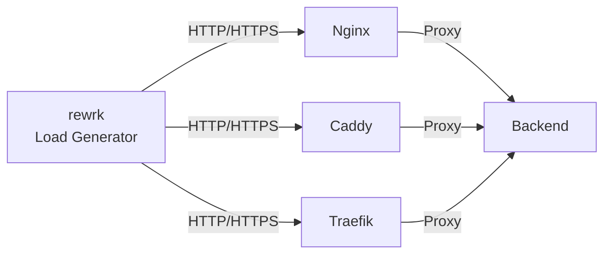

# Reverse Proxy Benchmark

[](https://github.com/fabianwimberger/reverse-proxy-benchmark/actions)
[](https://opensource.org/licenses/MIT)

Docker-based benchmarking suite comparing **Nginx**, **Caddy**, and **Traefik** across HTTP, HTTPS, HTTP/2, and resource-constrained scenarios.

## Architecture



## Quick Start

```bash
./run.sh
```

Requires Docker Compose and ~4GB RAM. Runs benchmarks (4 threads, 20 connections, 3s duration) and generates comparison charts in `results/charts/`.

## Key Findings

Based on actual benchmarks (~20KB JSON payload):

| Scenario | Winner | Result |
|----------|--------|--------|
| HTTP | Traefik | ~57K req/s, 0.35ms avg latency |
| HTTPS | Traefik | ~46K req/s, 48% faster than Nginx |
| Constrained (2CPU/2GB) | Nginx | Most consistent under limits |

TLS adds 30-40% overhead. Resource constraints reduce throughput by 50-70%.

## Configuration

Edit benchmark parameters in `run.sh` (search for `rewrk`):
```bash
rewrk -t4 -c20 -d3s --pct -h $url
```

Proxy configs are in `configs/{nginx,caddy,traefik}/`. Resource limits are defined in `docker-compose.yml`.

## Manual Usage

```bash
docker compose up -d                              # Start services
docker compose exec test-runner bash              # Enter container
rewrk -t4 -c20 -d3s --pct -h http://nginx:80/data.json  # Run single test
docker compose down -v                            # Stop and cleanup
```

## License

MIT
