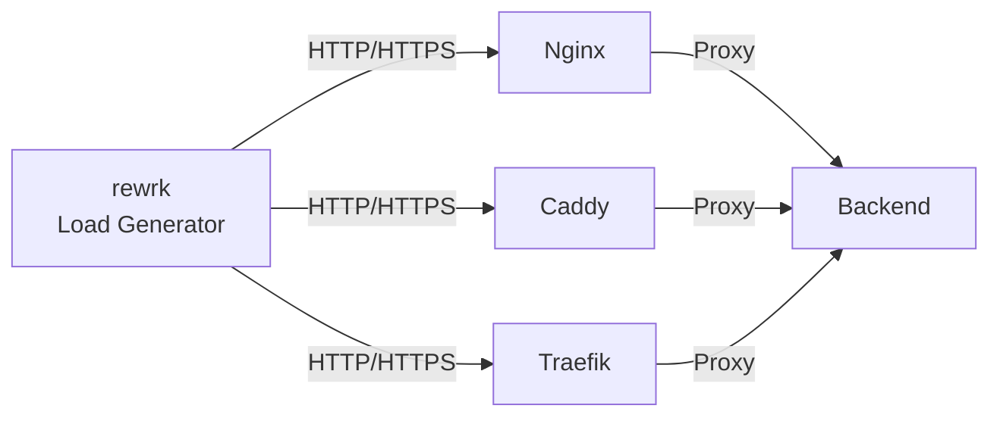
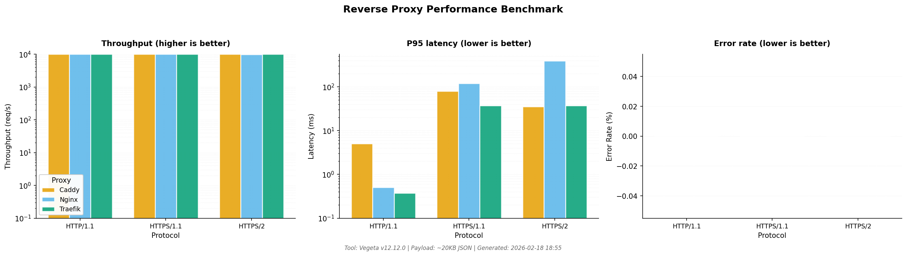

# Reverse Proxy Benchmark

[](https://github.com/fabianwimberger/reverse-proxy-benchmark/actions)
[](https://opensource.org/licenses/MIT)

Docker-based benchmarking suite comparing **Nginx**, **Caddy**, and **Traefik** across HTTP, HTTPS, HTTP/2, and resource-constrained scenarios.

```
make
```

## Architecture



## Requirements

- Docker with Docker Compose
- Make
- ~4GB RAM

## Usage

```bash
make              # Run full benchmark
make clean        # Stop and clean up
make THREADS=8 CONNECTIONS=50 DURATION=10s  # Custom parameters
```

## Key Findings

Based on actual benchmarks (~20KB JSON payload):

| Scenario | Winner | Result |
|----------|--------|--------|
| HTTP | Traefik | ~57K req/s, 0.35ms avg latency |
| HTTPS | Traefik | ~46K req/s, 48% faster than Nginx |
| Constrained (2CPU/2GB) | Nginx | Most consistent under limits |

TLS adds 30-40% overhead. Resource constraints reduce throughput by 50-70%.



## Configuration

Proxy configs: `configs/{nginx,caddy,traefik}/`

Resource limits: `docker-compose.yml`

Benchmark parameters: `Makefile` (THREADS, CONNECTIONS, DURATION)

## Manual

```bash
docker compose up -d
docker compose exec test-runner rewrk -t4 -c20 -d3s --pct -h http://nginx:80/data.json
docker compose down -v
```

## License

MIT
