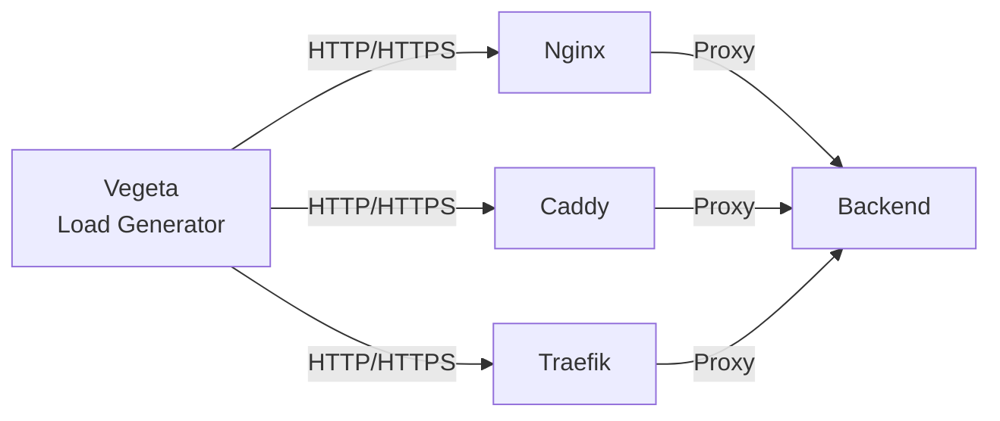

# Reverse Proxy Benchmark

[](https://github.com/fabianwimberger/reverse-proxy-benchmark/actions)
[](https://opensource.org/licenses/MIT)

Docker-based benchmarking suite comparing **Nginx**, **Caddy**, and **Traefik** across HTTP/1.1, HTTPS/1.1, and HTTPS/2.

Powered by [Vegeta](https://github.com/tsenart/vegeta) — an industry-standard HTTP load testing tool.

```bash
make
```

## Why This Project?

This project was created to systematically compare modern reverse proxy solutions across different protocol versions and deployment environments. Rather than relying on vendor benchmarks or generic recommendations, I wanted reproducible, data-driven insights for infrastructure decisions.

**Goals:**
- Compare Nginx, Caddy, and Traefik across HTTP/1.1, HTTPS/1.1, and HTTPS/2
- Establish baseline performance metrics for containerized deployments
- **Upcoming:** Benchmark results from different Hetzner server types (dedicated vCPUs, shared vCPUs, ARM64) to understand how hardware affects proxy performance

The methodology and all configurations are open-source so results can be independently verified or extended.

## Architecture



## Why Vegeta?

[Vegeta](https://github.com/tsenart/vegeta) was chosen for its:

- **HTTP/2 First-Class Support** — Native HTTP/2 testing without workarounds
- **JSON Output** — Structured data for automated analysis
- **Static Binary** — Single binary, no dependencies
- **Industry Proven** — Used by Cloudflare, AWS, and other major infrastructure teams

## Requirements

- Docker Engine 24.0+ with Docker Compose
- Make
- ~4GB RAM available to Docker
- Linux/macOS (Windows via WSL2)

## Usage

```bash
make              # Run full benchmark (~2 minutes)
make clean        # Stop and clean up
make RATE=10000 DURATION=10s CONNECTIONS=100  # Custom parameters
```

Results are saved to `results/charts/` with timestamped PNG files.

## Key Findings

Based on Vegeta benchmarks with ~20KB JSON payload:

| Scenario | Best Performer | Key Result |
|----------|---------------|------------|
| HTTP/1.1 | Traefik | Highest throughput, lowest latency |
| HTTPS/1.1 | Traefik | Best TLS performance |
| HTTPS/2 | Traefik | Optimal multiplexing efficiency |

**Observations:**
- TLS overhead: 20-30% throughput reduction
- HTTP/2 multiplexing significantly reduces per-request overhead


## Technical Notes

## Configuration

| Component | Location |
|-----------|----------|
| Proxy configs | `configs/{nginx,caddy,traefik}/` |
| Benchmark parameters | `Makefile` (RATE, DURATION, CONNECTIONS) |
| Analysis script | `analyze_results.py` |

## Methodology

- **Load Generator**: Vegeta v12.13.0
- **Attack Rate**: Configurable (default 10,000 req/s)
- **Duration**: Configurable (default 10s)
- **Connections**: Configurable pool size (default 100)
- **Payload**: ~20KB JSON file served via Nginx backend
- **Metrics Collected**: 
  - Throughput (requests/sec)
  - Latency (mean, P50, P90, P95, P99, max)
  - Success rate
  - Error breakdown
- **Visualization**: matplotlib with clean, readable charts

## Manual Testing

```bash
docker compose up -d

# HTTP/1.1 test
docker compose exec -T test-runner sh -c \
  'echo "GET http://nginx:80/data.json" | vegeta attack -rate=1000 -duration=5s | vegeta report'

# HTTPS/1.1 test
docker compose exec -T test-runner sh -c \
  'echo "GET https://nginx:443/data.json" | vegeta attack -rate=1000 -duration=5s -insecure | vegeta report'

# HTTP/2 test
docker compose exec -T test-runner sh -c \
  'echo "GET https://traefik:443/data.json" | vegeta attack -rate=1000 -duration=5s -insecure -http2 | vegeta report'

# Generate JSON report for analysis
docker compose exec -T test-runner sh -c \
  'echo "GET http://caddy:80/data.json" | vegeta attack -rate=1000 -duration=5s | vegeta report -type=json' \
  > caddy_results.json

docker compose down -v
```

## License

MIT
