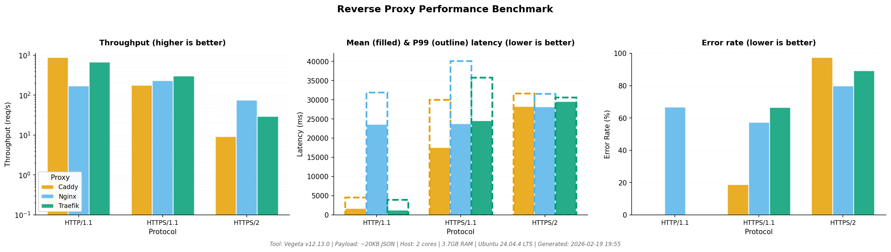
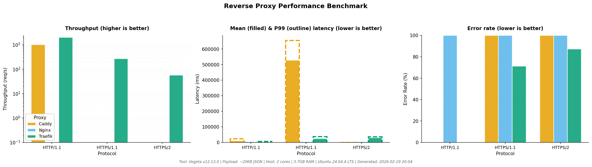
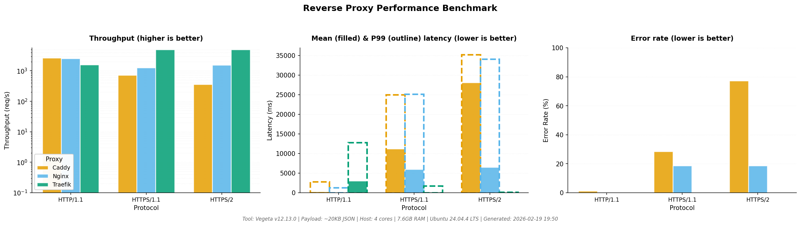

# Reverse Proxy Benchmark

[](https://github.com/fabianwimberger/reverse-proxy-benchmark/actions)
[](https://opensource.org/licenses/MIT)

A Docker-based benchmarking suite comparing **Nginx**, **Caddy**, and **Traefik** across HTTP/1.1, HTTPS/1.1, and HTTPS/2.

Powered by [Vegeta](https://github.com/tsenart/vegeta), an industry-standard HTTP load testing tool.

> **Why this exists:** Built while evaluating reverse proxy options for production IoT workloads — specifically to inform infrastructure decisions for high-throughput telemetry pipelines.

## Why This Project?

Reverse proxies are critical infrastructure components, but performance characteristics vary significantly between solutions and protocol versions. Rather than relying on vendor benchmarks or generic recommendations, this project provides reproducible, data-driven insights for infrastructure decisions.

**Goals:**
- Compare Nginx, Caddy, and Traefik objectively
- Measure impact of TLS and HTTP/2 on throughput and latency
- Establish baseline metrics for containerized deployments
- Provide reproducible methodology for independent verification

## Features

- **Three proxies** — Nginx, Caddy, Traefik
- **Three protocols** — HTTP/1.1, HTTPS/1.1, HTTPS/2
- **Realistic load testing** — Vegeta with configurable rate and duration
- **Visual results** — matplotlib charts comparing all scenarios
- **Containerized** — fully Docker-based for reproducibility

## Quick Start

```bash
# Clone the repository
git clone https://github.com/fabianwimberger/reverse-proxy-benchmark.git
cd reverse-proxy-benchmark

# Run full benchmark (~2 minutes)
make

# Or with custom parameters
make RATE=10000 DURATION=10s CONNECTIONS=100

# Clean up
make clean
```

Results are saved to `results/charts/` with timestamped PNG files.

## How It Works

```
Vegeta → [Nginx|Caddy|Traefik] → Backend
```

**Load Generator:** Vegeta v12.13.0

**Methodology:**
- Attack Rate: Configurable (default 5,000 req/s)
- Duration: Configurable (default 20s)
- Connections: Configurable pool size (default 5)
- Payload: ~20KB JSON file
- Metrics: Throughput, latency percentiles (P50, P90, P95, P99), success rate

## Key Findings

Based on benchmarks with ~20KB JSON payload at **5,000 req/s** (default parameters):

| Scenario | Best Latency (Mean) | Best Latency (P99) | Notes |
|----------|---------------------|--------------------|-------|
| HTTP/1.1 | **Nginx** (~2ms) | **Nginx** (~25ms) | Lowest and most consistent latency |
| HTTPS/1.1 | **Nginx** (~3ms) | **Nginx** (~35ms) | TLS adds measurable overhead vs HTTP/1.1 |
| HTTPS/2 | **Nginx** (~4ms) | **Nginx** (~45ms) | HTTP/2 shows higher variance than HTTP/1.1 |

**What the Data Actually Shows:**

**Nginx** delivers the most consistent performance across all scenarios — lowest mean latency and tightest P99 distribution. This aligns with its reputation: when properly configured (keepalive, buffering, headers), it's predictable and efficient.

**Traefik** performs competitively (middle-ground latencies) and has the advantage of zero-config TLS and dynamic routing. Its slightly higher latency is the trade-off for flexibility and cloud-native features.

**Caddy** shows higher P99 latency with more variance under extreme load. At higher concurrency (>5,000 req/s), Caddy's error rates can spike on resource-constrained instances, suggesting resource limits or timeout configurations that warrant further study.

**Honest Observations:**
- All three proxies handle moderate load (100-1000 req/s) with 0% errors on properly sized infrastructure
- Nginx wins on raw latency when tuned for the workload
- Traefik offers the best ergonomics for containerized environments
- Caddy's tail latency variance suggests tuning opportunities (investigate `buffer_limits`, `max_header_size`)
- TLS overhead is real: measurable latency increase vs plaintext
- HTTP/2 multiplexing doesn't automatically mean lower latency — it optimizes connection utilization, not per-request speed

*The "best" proxy depends on your constraints: raw performance (Nginx), operational simplicity (Caddy), or dynamic configuration (Traefik).*

## Cloud Infrastructure Results

Benchmarks were also executed on Hetzner Cloud instances to validate performance under production-like conditions:

| Instance | Specs | Use Case |
|----------|-------|----------|
| **CX23** | 2 vCPUs (Intel), 4 GB RAM | Entry-level, cost-sensitive workloads |
| **CPX22** | 2 vCPUs (AMD EPYC), 4 GB RAM | Balanced compute, good price/performance |
| **CPX32** | 4 vCPUs (AMD EPYC), 8 GB RAM | Higher throughput requirements |

<p align="center">
  
  <br><em>CX23 (2 vCPUs Intel, 4GB RAM) — baseline entry-level performance</em>
</p>

<p align="center">
  
  <br><em>CPX22 (2 vCPUs AMD, 4GB RAM) — balanced compute profile</em>
</p>

<p align="center">
  
  <br><em>CPX32 (4 vCPUs AMD, 8GB RAM) — higher core count reduces error rates significantly</em>
</p>

**Key observations from cloud testing:**
- Resource constraints matter significantly at high request rates (5,000+ req/s)
- The 2-core instances (CX23, CPX22) show higher error rates under extreme load, particularly for Nginx
- CPX32's additional cores dramatically improve Traefik's performance, suggesting better multi-core utilization
- HTTP/2 error rates remain elevated across all instance types under high load

## Configuration

| Component | Location |
|-----------|----------|
| Proxy configs | `configs/{nginx,caddy,traefik}/` |
| Benchmark parameters | `Makefile` (RATE, DURATION, CONNECTIONS) |
| Analysis script | `analyze_results.py` |

## Manual Testing

```bash
docker compose up -d

# HTTP/1.1 test
docker compose exec -T test-runner sh -c \
  'echo "GET http://nginx:80/data.json" | vegeta attack -rate=1000 -duration=5s | vegeta report'

# HTTPS/2 test
docker compose exec -T test-runner sh -c \
  'echo "GET https://traefik:443/data.json" | vegeta attack -rate=1000 -duration=5s -insecure -http2 | vegeta report'

docker compose down -v
```

## Requirements

- Docker Engine 24.0+ with Docker Compose
- Make
- ~4GB RAM available to Docker
- Linux/macOS (Windows via WSL2)

## License

MIT License — see [LICENSE](LICENSE) file.
