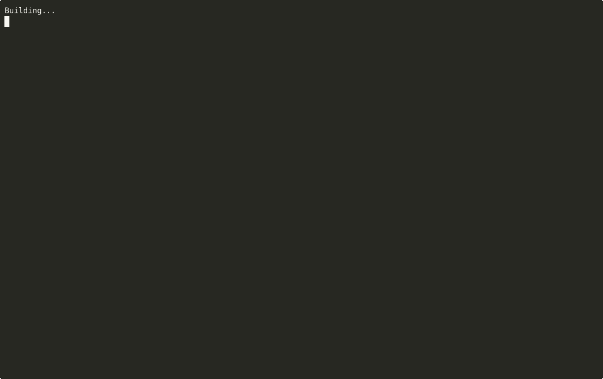
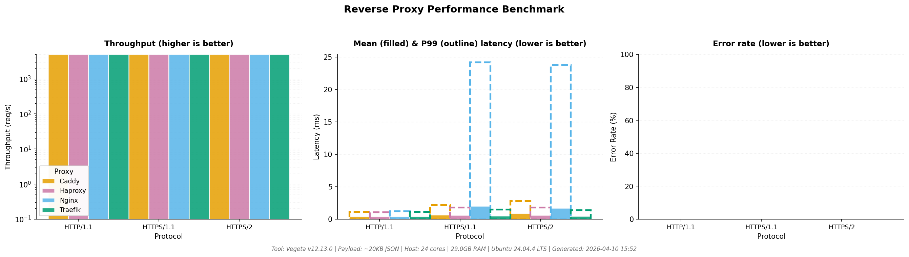

# Reverse Proxy Benchmark

[](https://github.com/fabianwimberger/reverse-proxy-benchmark/actions)
[](https://opensource.org/licenses/MIT)

A Docker-based benchmarking suite comparing **Nginx**, **Caddy**, **Traefik**, and **HAProxy** across HTTP/1.1, HTTPS/1.1, and HTTPS/2.

Powered by [Vegeta](https://github.com/tsenart/vegeta), an industry-standard HTTP load testing tool.

## Why This Project?

Reverse proxies are critical infrastructure components, but performance characteristics vary significantly between solutions and protocol versions. Rather than relying on vendor benchmarks or generic recommendations, this project provides reproducible, data-driven insights for infrastructure decisions.

**Goals:**
- Compare Nginx, Caddy, Traefik, and HAProxy objectively
- Measure impact of TLS and HTTP/2 on throughput and latency
- Establish baseline metrics for containerized deployments
- Provide reproducible methodology for independent verification

<p align="center">
  
  <br><em>Full benchmark run: build, test 12 scenarios, analyze results</em>
</p>

## Features

- **Four proxies** — Nginx, Caddy, Traefik, HAProxy
- **Three protocols** — HTTP/1.1, HTTPS/1.1, HTTPS/2
- **Realistic load testing** — Vegeta with configurable rate and duration
- **Visual results** — matplotlib charts comparing all scenarios
- **Containerized** — fully Docker-based for reproducibility

## Quick Start

```bash
# Clone the repository
git clone https://github.com/fabianwimberger/reverse-proxy-benchmark.git
cd reverse-proxy-benchmark

# Run full benchmark (~2 minutes)
make

# Or with custom parameters
make RATE=10000 DURATION=10s CONNECTIONS=100

# Clean up
make clean
```

Results are saved to `results/charts/` with timestamped PNG files.

## How It Works

```
Vegeta → [Nginx|Caddy|Traefik|HAProxy] → Backend
```

**Proxies:** Nginx 1.29.8 · Caddy 2.11.2 · Traefik 3.6.13 · HAProxy 3.3.6

**Load Generator:** Vegeta v12.13.0

**Methodology:**
- Attack Rate: Configurable (default 5,000 req/s)
- Duration: Configurable (default 20s)
- Connections: Configurable pool size (default 5)
- Payload: ~20KB JSON file
- Metrics: Throughput, latency percentiles (P50, P90, P95, P99), success rate

## Key Findings

Based on benchmarks with ~20KB JSON payload at **5,000 req/s** (default parameters), 0% errors across all scenarios:

| Scenario | Best Mean Latency | Best P99 Latency | Notes |
|----------|-------------------|------------------|-------|
| HTTP/1.1 | **Caddy/HAProxy** (~0.41ms) | **HAProxy** (~1.09ms) | All four within ~5% of each other. |
| HTTPS/1.1 | **Traefik** (~0.48ms) | **Traefik** (~1.47ms) | Nginx shows high tail latency (P99 ~24ms). |
| HTTPS/2 | **Traefik** (~0.46ms) | **Traefik** (~1.37ms) | Traefik remains the leader in TLS scenarios. HAProxy follows closely (~1.79ms P99). |

**Takeaway:** Performance is extremely tight on HTTP/1.1 across all proxies. Traefik continues to dominate TLS workloads (HTTPS/1.1 and HTTPS/2) with the lowest mean and P99 latencies. HAProxy shows excellent consistency across all protocols, while Nginx experienced higher tail latencies in TLS scenarios in this environment. All four achieved 100% success rate at 5,000 req/s.

*The "best" proxy depends on your constraints: plaintext throughput (Nginx), TLS performance + operational simplicity (Traefik), or auto-provisioned certificates (Caddy).*

## Benchmark Results

<p align="center">
  
  <br><em>5,000 req/s · 20s duration · ~20KB JSON payload · 0% errors across all scenarios</em>
</p>

## Configuration

| Component | Location |
|-----------|----------|
| Proxy configs | `configs/{nginx,caddy,traefik,haproxy}/` |
| Benchmark parameters | `Makefile` (RATE, DURATION, CONNECTIONS) |
| Analysis script | `analyze_results.py` |

## Requirements

Docker Engine 24.0+ with Docker Compose, Make, ~4GB RAM. Linux/macOS (Windows via WSL2).

## License

MIT License — see [LICENSE](LICENSE) file.

### Third-Party Licenses

| Component | License | Source |
|-----------|---------|--------|
| Vegeta | [MIT](https://github.com/tsenart/vegeta/blob/master/LICENSE) | https://github.com/tsenart/vegeta |
| Nginx | [BSD-2-Clause](https://nginx.org/LICENSE) | https://nginx.org/ |
| Caddy | [Apache-2.0](https://github.com/caddyserver/caddy/blob/master/LICENSE) | https://github.com/caddyserver/caddy |
| Traefik | [MIT](https://github.com/traefik/traefik/blob/master/LICENSE.md) | https://github.com/traefik/traefik |
| HAProxy | [GPL-2.0](http://www.haproxy.org/download/2.4/src/LICENSE) | http://www.haproxy.org/ |
